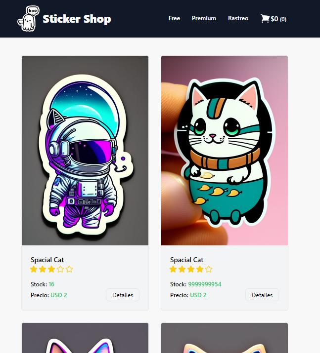

<!-- PROJECT LOGO -->
 

  
    <h3 align="center">Sticker Shop</h3>
    

    Ecommerce de Stickers generados por IA
     
    <a href="https://github.com/jarregui92/stickerShopReact"><strong>Explora el repo »</strong></a>
     
  

<!-- TABLE OF CONTENTS -->

  
Tabla de Contenido

  <ol>
    <li>
      <a href="#acerca-de-stickershop">Acerca de StickerShop</a>
      <ul>
        <li><a href="#objetivo">Objetivo</a></li>
        <li><a href="#como-funciona">Como Funciona</a></li>
        <li><a href="#construido-con">Construido con</a></li>
        <li><a href="#contacto">Contacto</a></li>
      </ul>
    </li>

  </ol>

<!-- ABOUT THE PROJECT -->
## Acerca de StickerShop

StickerShop es un proyecto de eCommerce de stickers creados por inteligencia artificial. Este proyecto es parte de mi curso de React Js en Coderhouse y representa mi proyecto final.

### Objetivo:
El objetivo principal de StickerShop es ofrecer una experiencia única de compra de stickers generados por IA. Queremos combinar la innovación tecnológica con la creatividad artística para proporcionarte stickers únicos y emocionantes.

### Como Funciona:
Nuestros stickers son generados por algoritmos de inteligencia artificial, lo que significa que cada diseño es único. Ofrecemos una variedad de categorías de stickers para adaptarnos a diferentes gustos.

¡Gracias por apoyar!

<a href="#readme-top">Ir Arriba ⬆️</a>

### Construido Con

- [![React.js]][React-url]
- [![Firebase]][Firebase-url]

<a href="#readme-top">Ir Arriba ⬆️</a>

## Características Actuales

El sistema actualmente soporta las siguientes funcionalidades:

- 🟩 Listado de Articulos
- 🟩 Filtro por Categorias
- 🟩 Detalle de Articulo
- 🟩 Trackeo de Pedidos por Nro Orden
- 🟩 Carrito de compras

## Futuras Actualizaciones

Estamos trabajando en las siguientes mejoras y funcionalidades:

- 🟨 Implementación de LocalStorage para guardar el carrito
- 🟨 Mejoras en la interfaz de usuario para dispositivos móviles
- 🟨 Añadir soporte multilenguaje
- 🟨 Añadir dashboard para administrar la web
- 🟨 Implementar 

<!-- CONTACT -->
## Contacto

Instagram - [Julian Arregui](https://instagram.com/jarregui92)

Linkedin - [Julian Arregui](https://www.linkedin.com/in/jarregui92/)

Version Prueba: [https://stickershop.jarregui.uy/](https://stickershop.jarregui.uy/)

<a href="#readme-top">Ir Arriba ⬆️</a>

<!-- MARKDOWN LINKS & IMAGES -->
[product-screenshot]: ./public/images/Captura.png
[React.js]: https://img.shields.io/badge/React-20232A?style=for-the-badge&logo=react&logoColor=61DAFB
[Firebase]: https://img.shields.io/badge/Firebase-20232A?style=for-the-badge&logo=firebase&logoColor=yellow
[React-url]: https://reactjs.org/
[Firebase-url]: https://firebase.google.com/
